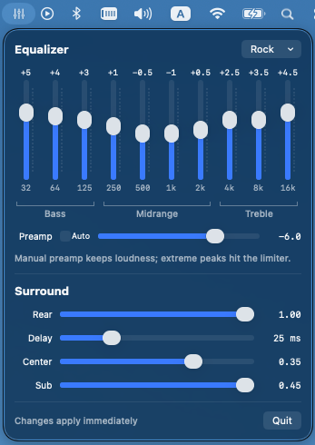

# upmixd

System-wide stereo → 5.1 upmixing for macOS, with a live parametric EQ and a
menu-bar control panel.

macOS never upmixes: stereo sources only reach the front pair of a surround
speaker rig, even when the output device runs 6 channels. Linux's sound
server fills all speakers by default; Windows has driver-level "speaker
fill"; macOS has nothing. `upmixd` is that missing layer:

```
apps → BlackHole 2ch (system default output) → upmixd → your 5.1 device
```

The daemon captures the system mix from [BlackHole](https://github.com/ExistentialAudio/BlackHole),
applies an optional EQ, upmixes (fronts passthrough, derived center, low-passed
LFE, delayed rears), and plays the result on your multichannel output through
a private aggregate device — hardware-clocked, drift-compensated.

- **No custom driver.** Class-compliant USB surround adapters (e.g. the
  C-Media CM6206 family) already work with macOS's built-in driver; they just
  default to 2-channel. `upmixd` switches them to 6ch/48kHz itself.
- **Clip-proof DSP.** The EQ's auto-headroom mode measures the worst-case
  cascade boost; a full-scale limiter backstops everything. All DSP is
  unit-tested and allocation-free on the audio thread.
- **Self-healing.** Unplug the output device (undock) and the default output
  falls back to the built-in speakers; plug it back in and surround returns
  within a second. A health probe restarts the pipeline if it ever goes
  silently wrong.
- **One config file.** `~/.config/upmixd.conf`, human-editable, reloaded the
  instant you save (directory watch, 10 s polling backstop). The menu-bar
  panel is just a pretty way to write it.

## Install

```sh
brew install --cask blackhole-2ch   # virtual audio driver (one-time)
sudo killall coreaudiod             # or reboot, to load it

brew install mzelem/tap/upmixd
brew services start upmixd          # starts now and at every login
upmixd-panel install                # optional menu-bar EQ panel
```

From source instead: clone, `make test`, `make install` (daemon, needs sudo
for /usr/local/bin) and `make install-panel` (panel, no sudo).

The daemon points the system default output at BlackHole while it runs and
puts it back on real speakers (the surround device, or the built-in speakers
if it's unplugged) when it stops (`brew services stop upmixd`).

## Equalizer and tuning

All settings live in `~/.config/upmixd.conf` (created on first run; override
with `--config`). Edit and save — the daemon reloads instantly. Example:

```
rear_gain = 0.9
rear_delay_ms = 25.0
center_gain = 0.354
lfe_gain = 0.45

# equalizer: eq_band = <freq_hz> <gain_db> [<q>]   (up to 16 bands)
eq_preamp_db = -6.0
eq_band = 80 4
eq_band = 3000 -2
```

The EQ is a cascade of peaking filters applied to the stereo mix before
upmixing. The default preamp is a fixed -6 dB of headroom — within a fraction
of a dB of every built-in preset's worst case — so adjusting one band never
shifts the level of the others. Set `eq_preamp_db = auto` to have the daemon
measure the worst-case combined boost and attenuate by exactly that:
guaranteed clip-free even with overlapping boosted bands, at the cost of the
overall level moving as you change the EQ. Boosts beyond the headroom on
full-scale content hit a hard full-scale limiter rather than distorting
downstream. A bad edit never takes audio down: invalid lines are logged and
ignored.



The panel (`upmixd-panel install`) gives you 10 vertical sliders with
Bass/Midrange/Treble groups, presets (Rock, Jazz, Bass Boost, …), the preamp
control, and the surround knobs. Hand-authored config bands it can't
represent (custom frequency, Q, or >12 dB) are preserved untouched.

## Docking and undocking

The daemon is resident and device-aware. Unplug the output device and it
falls the default output back to the built-in speakers, so laptop audio keeps
working immediately. Plug it back in and it reattaches within about a second
and points the default output back at BlackHole. No clicking around in Sound
settings either way.

## Notes

- Output channel order follows the CM6206 6ch layout: FL FR FC LFE RL RR.
- Volume keys work: BlackHole applies that gain to the loopback stream.
- Everything flows through the 2-channel capture: stereo music fills all
  speakers via the upmix, and surround sources are first downmixed to stereo
  by macOS, then upmixed. Discrete 5.1 passthrough is not supported (see
  roadmap).
- Previously installed from source with `make install`? Run `make uninstall`
  (and `make uninstall-panel`) before switching to brew — the two installs
  use different launchd labels and would run two daemons at once.
- Logs: `~/Library/Logs/upmixd.log` (Makefile install) or
  `$(brew --prefix)/var/log/upmixd.log` (brew services).
- Uninstall: first `upmixd-panel uninstall` (while the tool still exists),
  then `brew services stop upmixd && brew uninstall upmixd`, and optionally
  the blackhole-2ch cask.
- After `brew upgrade upmixd`, rerun `upmixd-panel install` to refresh the
  copied panel app.

## Roadmap

- Signed, notarized one-click `.pkg` installer bundling a renamed virtual
  device ("Surround Speakers (upmixd)") so the Sound menu says what you'll
  actually hear — pending an Apple Developer ID.
- Per-output-channel EQ (room correction).
- Discrete 5.1 passthrough via an 8-channel capture device, so surround
  sources keep their original channels instead of a downmix→upmix trip.

## Support

If upmixd is useful to you, you can [buy me a coffee](https://buymeacoffee.com/mzelem)
— though honestly, if it's useful to you it's already made my day.

## License

MIT. BlackHole is a separate project (GPL-3.0) installed from its own
official distribution; upmixd does not link against or bundle it.
